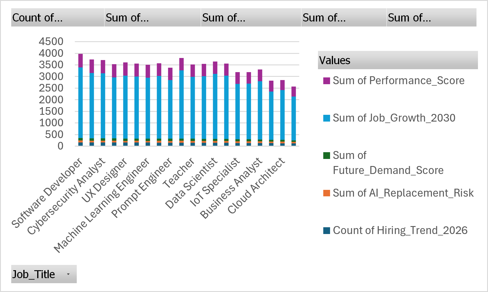

# AI-Jobs-2030-Analysis_
Analysis of AI's impact on future job markets using Kaggle dataset.
## Dashboard Preview

## Key Insights
- Machine Learning Engineer, Data Scientist, and Cloud Architect show the strongest growth and demand by 2030.
- Prompt Engineer and IoT Specialist are emerging roles with rising demand but moderate performance scores.
- Software Developer, UX Designer, and Business Analyst remain stable but face moderate AI replacement risk.
- Teacher and other traditional roles show higher automation risk, highlighting need for reskilling.
- Cybersecurity Analyst stands out with strong demand and low replacement risk, making it resilient.

## Conclusion
This analysis highlights that AI will reshape the job market by 2030.  
- Tech‑driven roles will thrive with high demand and growth.  
- Hybrid skills (AI + domain expertise) will emerge as new career paths.  
- Routine and traditional jobs face automation risk, requiring adaptation.  
- Cybersecurity remains a safe and growing field, critical in an AI‑powered future.  

Overall, jobs that combine **AI expertise + domain knowledge** will dominate, while routine roles must evolve to stay relevant.
